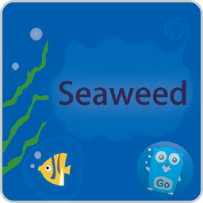

# SeaweedFS S3 Object Storage — Jelastic/Virtuozzo JPS Template

One-click **S3-compatible object storage** (SeaweedFS · Apache-2.0 · production-proven) for the Jelastic/Virtuozzo Application Platform — with built-in HTTPS/domain mapping and a safe long-term version-management workflow.

**[English](#english) · [ภาษาไทย](#ภาษาไทย)**

> ⚠️ **Status: scaffold / not yet validated on a live platform.** Built by forking the verified `rustfs-jps-template` shared pattern. Engine-specific items and `[VERIFY-LIVE]` / `[TODO พรุ่งนี้]` markers must be resolved (incl. pinning a real SeaweedFS tag) before a marketplace release.
>
> ⚠️ **สถานะ: scaffold / ยังไม่ทดสอบบนแพลตฟอร์มจริง** — fork มาจาก shared pattern ของ `rustfs-jps-template` ที่ verify แล้ว ต้องปิด `[VERIFY-LIVE]`/`[TODO พรุ่งนี้]` (รวมถึง pin tag SeaweedFS จริง) ก่อนปล่อยขึ้น marketplace

This is the **SeaweedFS** repo (production-recommended engine). The **RustFS** engine is a *separate sibling repo* (`rustfs-jps-template`) sharing this exact pattern. No runtime engine selector — engine is fixed per repo by design.

---

## English

### One-click deploy

**Or import manually:** dashboard → Import → JPS → `https://raw.githubusercontent.com/Ruk-Com-Cloud/seaweedfs-jps-template/main/manifest.jps`

### Install options

| Option | Choices |
|---|---|
| **Topology** | `single` (default, production-safe) · `cluster` (scaffold placeholder — refine) |
| **Public IP** | attach (default, recommended) · none |
| **Your S3 domain** | optional; two-phase SSL flow |

### Two-phase domain + HTTPS

1. Install → S3 on temporary HTTP; success page shows public IP + DNS A-record steps.
2. After DNS propagates → click **Bind SSL / Issue Certificate** → cert issued/bound on the LB, endpoint flips to `https://<your-domain>`.

S3 is **path-style only** — configure clients with force-path-style.

### Version management

**Change Version** add-on: pick a tested tag → backup taken first → redeploy with volume data preserved (`useExistingVolumes`) → `/healthz` verified. Rollback = re-run, pick previous version (restore `/backups` snapshot if needed).

### Engine specifics (SeaweedFS)

- Image `chrislusf/seaweedfs`; all-in-one `weed server -s3 -filer` (single node)
- S3 API port **8333**; health `GET /healthz` (never `/` with auth → 403)
- Credentials via generated `/config/s3.json` (forced, non-default)
- SeaweedFS is mature/Apache-2.0 but has **no SemVer/LTS** → tested-tag discipline still applies

### Repo layout

`manifest.jps` · `configs/vers.yaml` · `scripts/{beforeInit,deployHook}.js` · `nginx/s3-proxy.{inc,conf.tpl}` · `addons/{bind-ssl,change-version}.jps` · `text/*.md` · `tests/s3-smoke.sh` · `.github/workflows/ci.yml`

### Security

Forced generated credentials (no defaults), console not public, TLS terminated at the LB. MIT (template); SeaweedFS upstream Apache-2.0.

### Open `[TODO พรุ่งนี้]` / `[VERIFY-LIVE]`

Pin a real tested SeaweedFS tag (vers.yaml + change-version) · design real cluster topology (master/volume/filer) · confirm s3.json boot-before-config restart · LE deployHook :443 end-to-end · public-IP/quota · S3 E2E via LB · s3-tests baseline.

---

## ภาษาไทย

### ติดตั้งคลิกเดียว

**หรือ import เอง:** dashboard → Import → JPS → `https://raw.githubusercontent.com/Ruk-Com-Cloud/seaweedfs-jps-template/main/manifest.jps`

### ตัวเลือกตอนติดตั้ง

| ตัวเลือก | ค่าที่เลือกได้ |
|---|---|
| **Topology** | `single` (ค่าเริ่มต้น ปลอดภัย) · `cluster` (ยังเป็น scaffold — รอ refine) |
| **Public IP** | แนบ (ค่าเริ่มต้น แนะนำ) · ไม่แนบ |
| **โดเมน S3** | ไม่บังคับ; flow SSL สองเฟส |

### ผูกโดเมน + HTTPS สองเฟส

1. ติดตั้ง → S3 บน HTTP ชั่วคราว, หน้า success แสดง public IP + ขั้นตอน DNS
2. หลัง DNS propagate → กด **Bind SSL / Issue Certificate** → ออก/ผูก cert ที่ LB, สลับเป็น `https://<โดเมน>`

S3 ใช้ **path-style เท่านั้น**

### การจัดการเวอร์ชัน

ปุ่ม **Change Version**: เลือก tag ที่ทดสอบแล้ว → สำรองข้อมูลก่อน → redeploy คงข้อมูลใน volume → เช็ค `/healthz` → rollback ได้ (เลือกเวอร์ชันก่อนหน้า, กู้จาก `/backups`)

### จุดเฉพาะของ SeaweedFS

- Image `chrislusf/seaweedfs`; all-in-one `weed server -s3 -filer` (single node)
- S3 port **8333**; health `GET /healthz` (ห้าม `/` ตอนเปิด auth → 403)
- Credential ผ่าน `/config/s3.json` ที่ generate (บังคับ ไม่มี default)
- SeaweedFS mature/Apache-2.0 แต่ **ไม่มี SemVer/LTS** → ใช้ tested-tag discipline เหมือนกัน

### License

MIT (ตัว template) — ดู `LICENSE`; SeaweedFS upstream เป็น Apache-2.0 (<https://github.com/seaweedfs/seaweedfs>)

### `[TODO พรุ่งนี้]` / `[VERIFY-LIVE]` ที่ค้าง

pin tag SeaweedFS จริง (vers.yaml + change-version) · ออกแบบ cluster topology จริง (master/volume/filer) · ยืนยัน restart หลังเขียน s3.json · LE deployHook :443 ครบ flow · public-IP/quota · S3 E2E ผ่าน LB · baseline s3-tests
